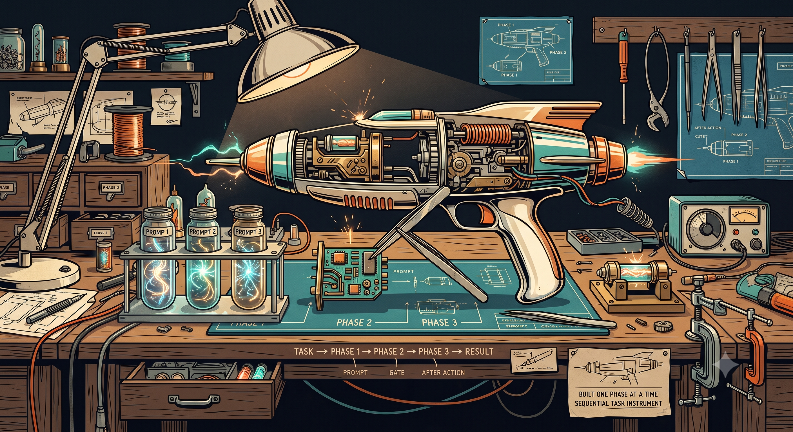
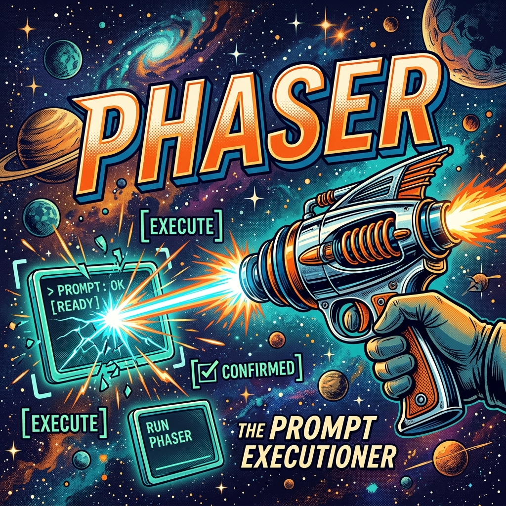
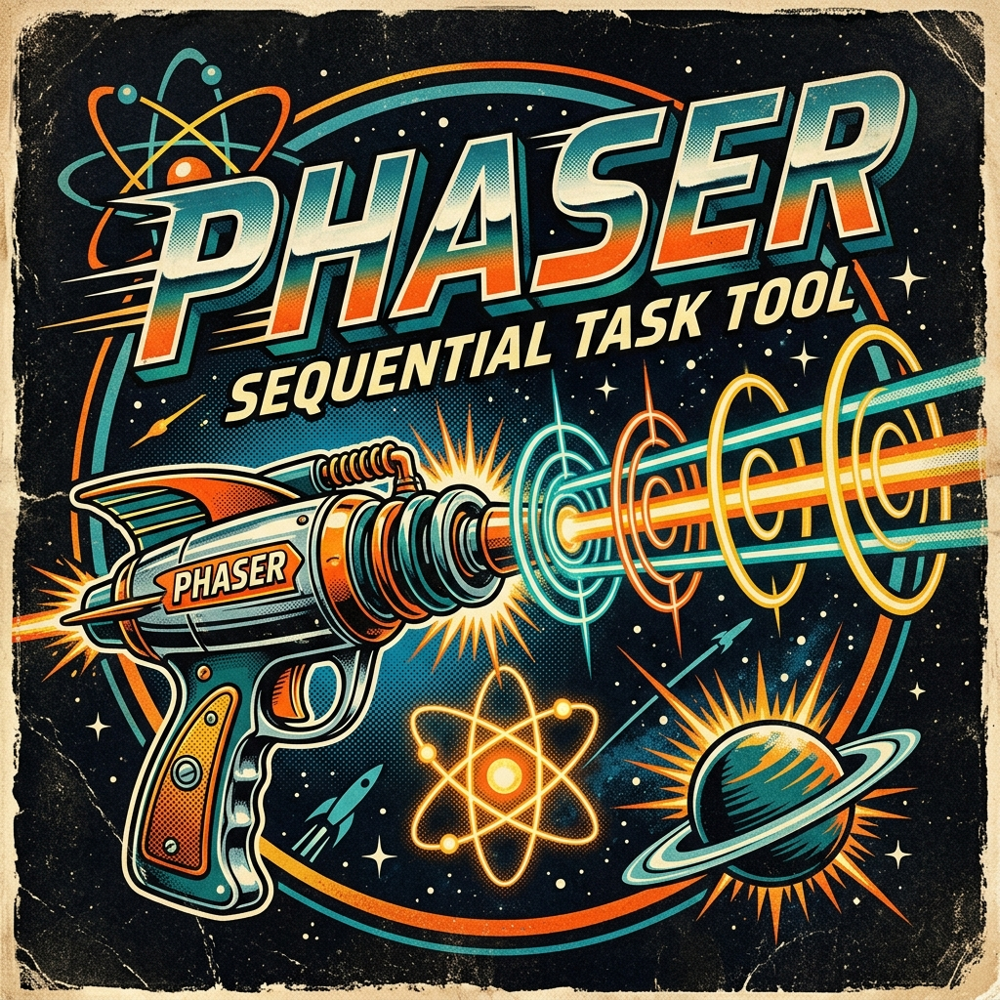
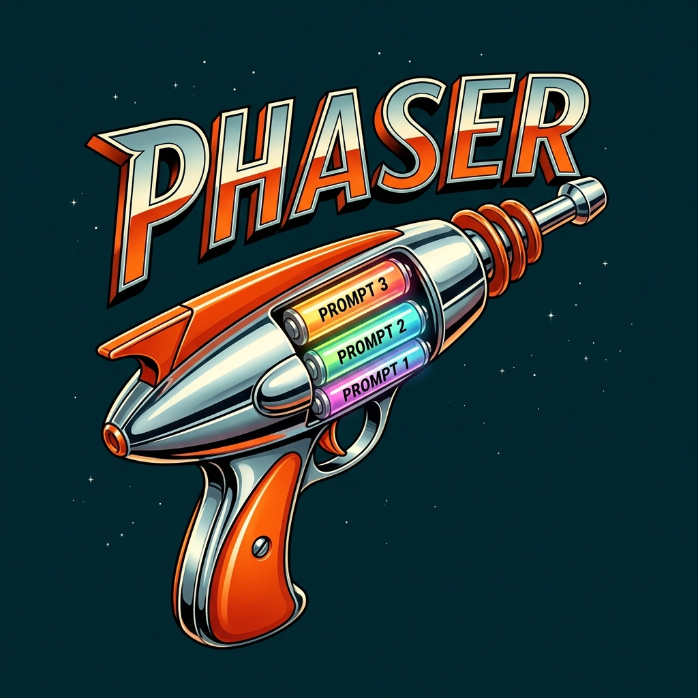

# Phaser

Welcome to **Phaser**, your step-by-step assistant for getting things done! Phaser is a simple, effective skill designed to help you break down complex tasks into a clear sequence of manageable steps.

## What to Expect

When you use Phaser, you can expect a smooth, organized workflow instead of an attempt to do everything at once. It takes the guesswork out of complex projects, ensuring steady progress with built-in opportunities for you to steer the ship. 

## How to Use It

To get started with Phaser, simply tell your AI assistant to:
- "Create a solution doc"
- "Solve this with phaser"
- Or ask it to "plan a phased task" for whatever you're working on.

The AI will analyze your goal and generate a customized plan—called a **Phase File**. This file will be saved in a `phaser/` folder in your project.

## The Power of the Phase File (.phaser.md)

Think of the phase file as a smart checklist and instruction manual rolled into one. Here’s why it’s so incredibly useful:

* **Clear Roadmap**: It organizes your overall task into a numbered list of instructions (prompts) so you know exactly what’s happening at every stage.
* **Built-in Pauses (Gates)**: It knows when to take a breather! It will automatically stop to let you review work, commit your progress, or ask you questions if it needs clarification before moving forward.
* **Progress Tracking**: As each step is completed, the file updates itself with a summary of the work done. You never lose your place.
* **Documentation Built-In**: Once the final step is checked off, the phase file makes sure the overall project documentation is updated to reflect everything that was accomplished.

For a detailed visual breakdown of how these documents are structured, check out the **[Anatomy of a Phase File](docs/anatomy.md)**.

## Sample Projects

Explore these sample projects that were built using the Phaser skill to see it in action:
- **[Hello World Sample](samples/hello-world-sample)**: A simple interactive and animated "Hello World" application.
- **[Text Scramble Sample](samples/text-scramble-sample)**: A visually engaging text scrambling effect with bouncy letters and color-shifting physics.

