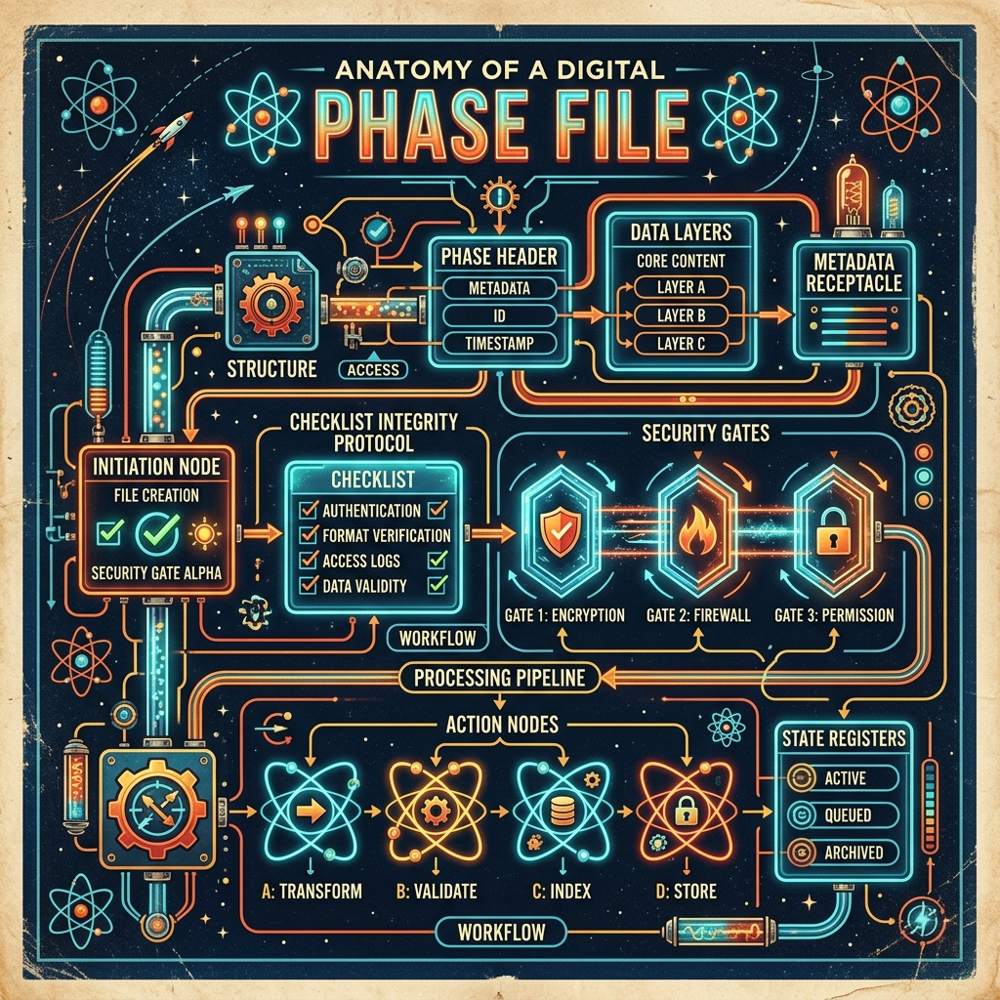

# The Anatomy of a Phase File

A **Phase File** (ending in `.phaser.md`) is a self-contained instruction manual generated by the Phaser skill. It serves as both a roadmap for completing a complex task and a persistent state tracker that records progress. 

When you ask an AI to create a phase file, it constructs a document with a very specific, standardized anatomy. Here is how that anatomy breaks down:

## 1. Phase Header & Task Description
At the very top of the document is a high-level title and a clear description of the overall task. This ensures anyone (human or AI) reading the file immediately understands the ultimate goal.

## 2. Instructions for AI Execution
This section is the "brain" of the phase file. It contains strict rules that any AI agent must follow when executing the file. It tells the AI to work sequentially, record its actions, and respect the "Security Gates" before moving on.

## 3. Prompts to Execute
The core of the phase file is the checklist of prompts. The overarching task is broken down into small, digestible, numbered steps. Each step contains:

* **The Prompt:** Detailed instructions on what specifically needs to be accomplished in this step.
* **The Gate:** A control mechanism that determines what happens *after* the prompt is executed.
    * `STOP & COMMIT`: The AI must stop, suggest a git commit, and wait for the user to confirm before moving on.
    * `NEEDS CLARIFICATION`: The AI must pause to ask the user a question.
    * `NONE`: The AI can immediately proceed to the next step.

## 4. After Action Reports
This is where the phase file acts as a state tracker. Every time a prompt is successfully completed, the executing AI injects an `***After Action***` block directly beneath the prompt. This block summarizes the work done, code changes made, and files modified. It allows the user (and the AI) to easily see what has already been accomplished without needing to re-run previous steps.

## 5. Final Step: Documentation
The end of the phase file contains a final directive. Once all prompts are completed and their After Action blocks are filled in, the AI evaluates the entire accumulated body of work and updates the project's documentation in the `./docs/` folder.

---

By adhering to this anatomy, the Phase File transforms complex, open-ended requests into a reliable, step-by-step pipeline that guarantees visibility, user control, and consistent results.
